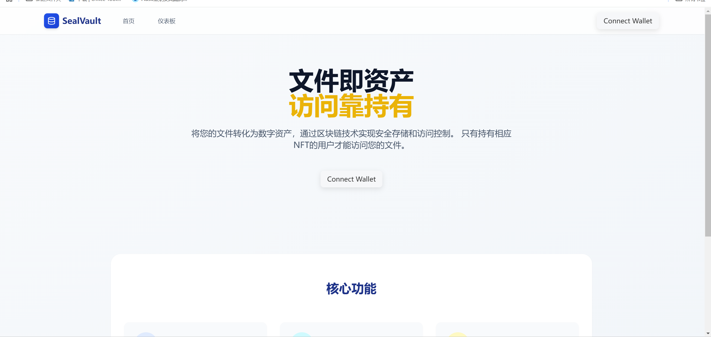
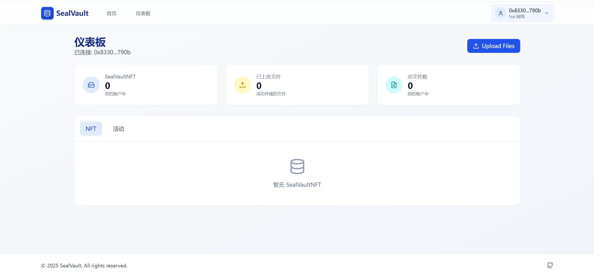

# SealVault

SealVault 是一个基于 Sui 区块链的去中心化应用程序（dApp），由智能合约后端和现代化 Web 前端组成。

## 项目结构

项目包含两个主要部分：

- `sealvault/`: Move 智能合约代码
- `SealVault-Frontend/`: React 前端应用


## 开发环境设置

### 智能合约开发
1. 安装 Sui CLI
2. 克隆项目
3. 进入 `sealvault` 目录
4. 编译合约：
   ```bash
   sui move build
   ```

### 前端开发
1. 确保安装了 Node.js (推荐使用 v18+)
2. 进入 `SealVault-Frontend` 目录
3. 安装依赖：
   ```bash
   npm install
   ```
4. 启动开发服务器：
   ```bash
   npm run dev
   ```
5. 构建生产版本：
   ```bash
   npm run build
   ```

## Demo

### 主界面


### 文件上传



## 许可证

本项目采用 GNU General Public License v3.0 (GPL-3.0) 许可证。
